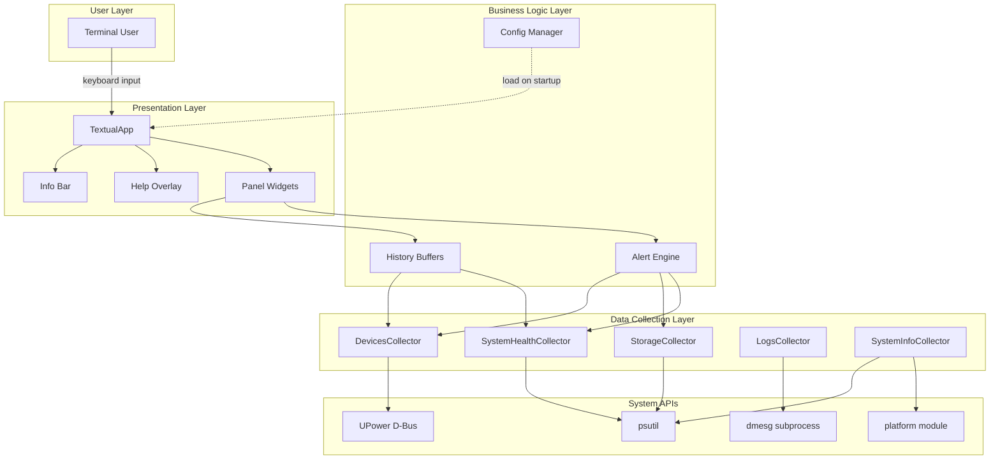
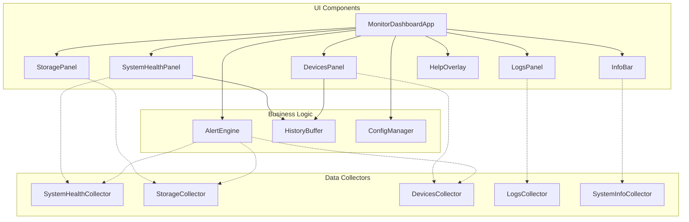
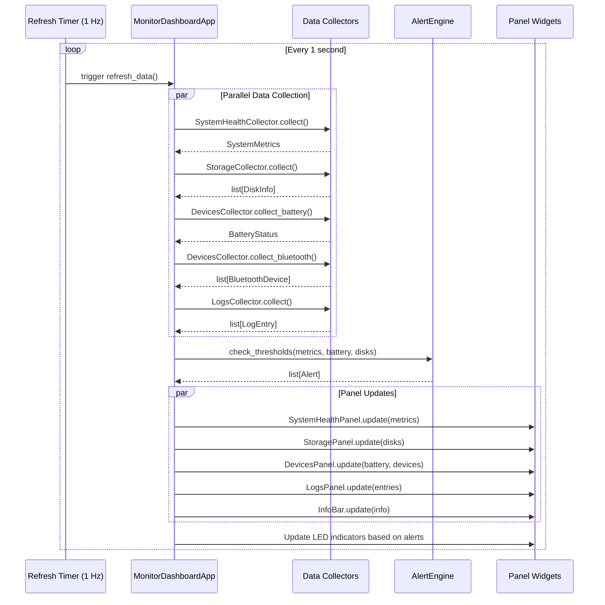
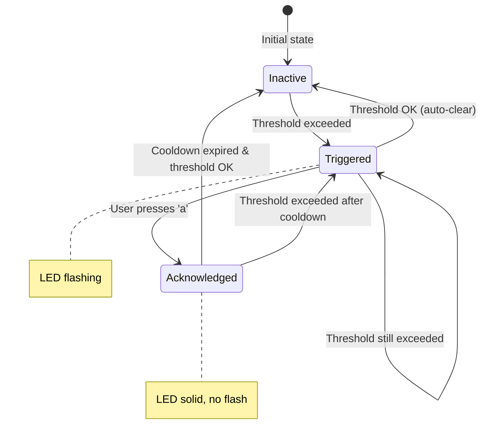
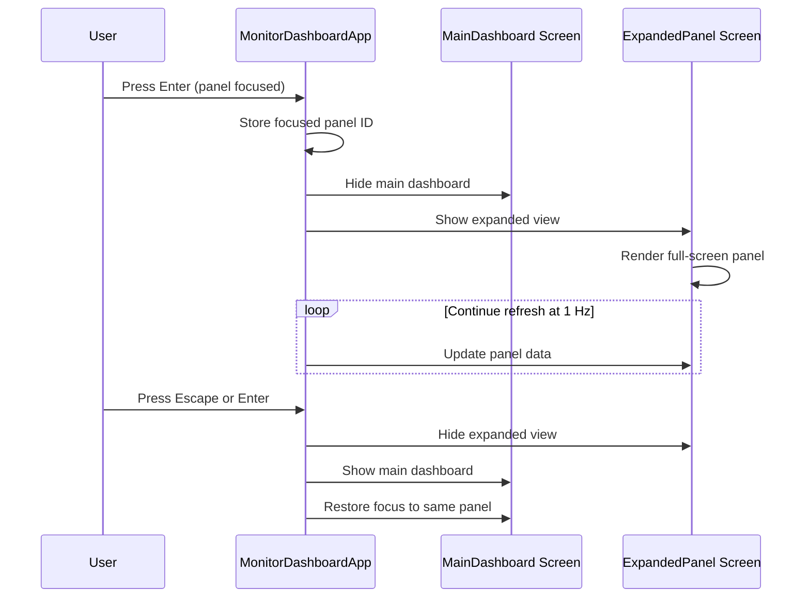

# monitor_dashboard Architecture Document

## Introduction

This document outlines the complete architecture for **monitor_dashboard**, a Python-based Terminal User Interface (TUI) application for real-time system monitoring. It serves as the authoritative blueprint for AI-driven development, ensuring consistency across all modules and adherence to chosen patterns and technologies.

**Relationship to Frontend Specification:**
The separate [Front-End Spec](front-end-spec.md) details UI/UX design, component styling, and interaction patterns. This architecture document defines the technical implementation that realizes that specification.

### Starter Template

**N/A - Greenfield project**

This is a new project built from scratch using Python's `textual` TUI framework. No starter template is used; the project structure follows textual best practices and Python packaging standards (PEP 517/518).

### Change Log

| Date | Version | Description | Author |
|------|---------|-------------|--------|
| 2026-01-17 | 1.0 | Initial architecture document | Winston (Architect) |

---

## High-Level Architecture

### Technical Summary

monitor_dashboard is a **single-process monolithic TUI application** built with Python and the textual framework. The architecture follows a **layered design** with clear separation between data collection, business logic (alerts), and presentation (UI panels). Data flows unidirectionally from system APIs (psutil, UPower D-Bus) through collector modules into the UI layer, which renders at 1 Hz refresh rate. The application runs entirely locally with no network dependencies, storing only user configuration in a YAML file. This architecture prioritizes simplicity, maintainability, and minimal resource consumption (<2% CPU, <50MB RAM) while delivering real-time monitoring with a distinctive GEM desktop aesthetic.

### High-Level Overview

**Architectural Style:** Monolith (single-process desktop application)

**Repository Structure:** Monorepo (single repository, single application)

**Service Architecture:** N/A (no services - standalone local application)

**Primary Data Flow:**
1. System APIs (psutil, UPower) provide raw metrics
2. Data Source modules collect and normalize data at 1 Hz
3. History buffers maintain rolling time-series data
4. Alert Engine evaluates thresholds and manages alert state
5. UI Panels render data using textual widgets
6. User input (keyboard) triggers navigation, expansion, and alert acknowledgment

**Key Architectural Decisions:**

| Decision | Choice | Rationale |
|----------|--------|-----------|
| TUI Framework | textual | Modern async Python TUI with CSS-like styling, rich widget library |
| Data Collection | psutil + pydbus | psutil for system metrics, pydbus for UPower/Bluetooth D-Bus APIs |
| Refresh Model | Polling at 1 Hz | Simple, predictable, minimal CPU overhead |
| State Management | In-memory only | No persistence needed; dashboard is ephemeral monitoring |
| Configuration | YAML file | Human-readable, simple to edit, standard format |

### High-Level Architecture Diagram



### Architectural and Design Patterns

- **Layered Architecture:** Clear separation between presentation, business logic, and data access layers - _Rationale:_ Enables independent testing and modification of each layer without affecting others

- **Observer Pattern (via textual reactivity):** UI components automatically update when underlying data changes - _Rationale:_ textual's reactive system handles efficient partial re-renders

- **Collector Pattern:** Each data domain (health, storage, devices, logs) has a dedicated collector module - _Rationale:_ Single responsibility, easy to mock for testing, graceful degradation if one fails

- **Circular Buffer Pattern:** Fixed-size history buffers for time-series data - _Rationale:_ Bounded memory usage, automatic old data eviction, O(1) append operations

- **Singleton Pattern (Config):** Single configuration instance loaded at startup - _Rationale:_ Configuration is read-only after load, no need for multiple instances

- **State Machine (Alert Engine):** Alerts transition through states: inactive → triggered → acknowledged - _Rationale:_ Clear state transitions, hysteresis support, predictable behavior

---

## Tech Stack

### Technology Stack Table

| Category | Technology | Version | Purpose | Rationale |
|----------|------------|---------|---------|-----------|
| **Language** | Python | 3.10+ | Primary development language | Modern typing, match statements, wide ecosystem |
| **TUI Framework** | textual | 0.47.1 | Terminal UI framework | Async, CSS styling, rich widgets, active development |
| **System Metrics** | psutil | 5.9.8 | CPU, memory, disk, process data | Cross-platform, comprehensive, well-maintained |
| **D-Bus Access** | pydbus | 0.6.0 | UPower battery/Bluetooth data | Pythonic D-Bus interface, async support |
| **Configuration** | PyYAML | 6.0.1 | Config file parsing | Standard YAML library, safe loading |
| **Clipboard** | pyperclip | 1.8.2 | Log copy to clipboard | Cross-platform clipboard access |
| **Testing** | pytest | 8.0.0 | Test framework | Industry standard, excellent fixtures, plugins |
| **Testing (textual)** | pytest-textual-snapshot | 0.4.0 | TUI snapshot testing | Official textual testing support |
| **Mocking** | pytest-mock | 3.12.0 | Test mocking | Clean pytest integration |
| **Code Formatting** | black | 24.1.0 | Code formatter | Opinionated, consistent, widely adopted |
| **Linting** | ruff | 0.2.0 | Fast linter | Replaces flake8/isort, very fast |
| **Type Checking** | mypy | 1.8.0 | Static type analysis | Catches type errors, improves IDE support |
| **Build System** | hatchling | 1.21.0 | PEP 517 build backend | Modern, fast, good defaults |
| **Package Manager** | pip | latest | Dependency management | Standard Python, pyproject.toml support |

### Dependency Licenses

All dependencies use permissive open-source licenses compatible with free distribution:

| Dependency | License | Notes |
|------------|---------|-------|
| textual | MIT | Textualize Inc. |
| psutil | BSD-3-Clause | Giampaolo Rodola |
| pydbus | LGPL-2.1 | Laszlo Simon |
| PyYAML | MIT | Kirill Simonov |
| pyperclip | BSD-3-Clause | Al Sweigart |
| pytest | MIT | Holger Krekel |
| black | MIT | Łukasz Langa |
| ruff | MIT | Astral Software |
| mypy | MIT | Jukka Lehtosalo |
| hatchling | MIT | Ofek Lev |

**Note:** pydbus uses LGPL-2.1; since we import it as a library without modification, this is compatible with any project license.

### Runtime Requirements

- **Python:** 3.10 or higher (required for modern typing and match statements)
- **Terminal:** 256-color support, Unicode box-drawing characters
- **Platform:** Linux (Ubuntu/GNOME primary target)
- **Permissions:** User-level (dmesg may require appropriate group membership)

---

## Data Models

### SystemMetrics

**Purpose:** Represents a snapshot of system health metrics at a point in time.

**Key Attributes:**
- `timestamp`: datetime - When the metrics were collected
- `cpu_percent`: float - Overall CPU usage percentage (0-100)
- `cpu_per_core`: list[float] - Per-core CPU percentages
- `memory_used`: int - Memory used in bytes
- `memory_total`: int - Total memory in bytes
- `memory_percent`: float - Memory usage percentage
- `load_avg`: tuple[float, float, float] - 1, 5, 15 minute load averages

```python
@dataclass
class SystemMetrics:
    timestamp: datetime
    cpu_percent: float
    cpu_per_core: list[float]
    memory_used: int
    memory_total: int
    memory_percent: float
    load_avg: tuple[float, float, float]
```

### DiskInfo

**Purpose:** Represents usage information for a single mounted partition.

**Key Attributes:**
- `mount_point`: str - Filesystem mount path (e.g., "/home")
- `device`: str - Device path (e.g., "/dev/sda1")
- `fs_type`: str - Filesystem type (e.g., "ext4")
- `total`: int - Total space in bytes
- `used`: int - Used space in bytes
- `free`: int - Free space in bytes
- `percent`: float - Usage percentage

```python
@dataclass
class DiskInfo:
    mount_point: str
    device: str
    fs_type: str
    total: int
    used: int
    free: int
    percent: float
```

### BatteryStatus

**Purpose:** Represents laptop battery state including charge level and time estimates.

**Key Attributes:**
- `percent`: float - Current charge percentage (0-100)
- `state`: BatteryState - Enum: CHARGING, DISCHARGING, FULL, UNKNOWN
- `time_remaining`: int | None - Seconds until full/empty, None if unknown
- `is_present`: bool - Whether a battery is detected

```python
class BatteryState(Enum):
    CHARGING = "charging"
    DISCHARGING = "discharging"
    FULL = "full"
    UNKNOWN = "unknown"

@dataclass
class BatteryStatus:
    percent: float
    state: BatteryState
    time_remaining: int | None
    is_present: bool
```

### BluetoothDevice

**Purpose:** Represents a connected Bluetooth device with optional battery info.

**Key Attributes:**
- `name`: str - Device display name
- `address`: str - Bluetooth MAC address
- `device_type`: DeviceType - Enum: HEADPHONES, MOUSE, KEYBOARD, OTHER
- `battery_percent`: int | None - Battery level if available
- `is_connected`: bool - Current connection state

```python
class DeviceType(Enum):
    HEADPHONES = "headphones"
    MOUSE = "mouse"
    KEYBOARD = "keyboard"
    GAMEPAD = "gamepad"
    OTHER = "other"

@dataclass
class BluetoothDevice:
    name: str
    address: str
    device_type: DeviceType
    battery_percent: int | None
    is_connected: bool
```

### LogEntry

**Purpose:** Represents a single parsed dmesg log entry.

**Key Attributes:**
- `timestamp`: datetime - When the log entry was recorded
- `severity`: LogSeverity - Enum: ERROR, WARNING, NOTICE, INFO, DEBUG
- `message`: str - The log message text
- `raw`: str - Original unparsed line

```python
class LogSeverity(Enum):
    EMERGENCY = "emerg"
    ALERT = "alert"
    CRITICAL = "crit"
    ERROR = "err"
    WARNING = "warn"
    NOTICE = "notice"
    INFO = "info"
    DEBUG = "debug"

@dataclass
class LogEntry:
    timestamp: datetime
    severity: LogSeverity
    message: str
    raw: str
```

### Alert

**Purpose:** Represents an active or acknowledged system alert.

**Key Attributes:**
- `alert_type`: AlertType - Enum: LOW_BATTERY, HIGH_CPU, LOW_MEMORY, LOW_DISK, DEVICE_DISCONNECT
- `message`: str - Human-readable alert description
- `triggered_at`: datetime - When the alert was first triggered
- `acknowledged`: bool - Whether user has dismissed the alert
- `source_panel`: str - Which panel this alert relates to

```python
class AlertType(Enum):
    LOW_BATTERY = "low_battery"
    HIGH_CPU = "high_cpu"
    LOW_MEMORY = "low_memory"
    LOW_DISK = "low_disk"
    DEVICE_DISCONNECT = "device_disconnect"

@dataclass
class Alert:
    alert_type: AlertType
    message: str
    triggered_at: datetime
    acknowledged: bool = False
    source_panel: str = ""
```

### AppConfig

**Purpose:** User configuration loaded from YAML file.

**Key Attributes:**
- `refresh_rate`: float - Data refresh interval in seconds (default: 1.0)
- `history_length`: int - Number of history points to retain (default: 120)
- `log_buffer_size`: int - Maximum log entries to buffer (default: 100)
- `thresholds`: ThresholdConfig - Alert threshold values

```python
@dataclass
class ThresholdConfig:
    battery_low: int = 20        # percent
    cpu_high: int = 80           # percent
    memory_low: int = 10         # percent free
    disk_low: int = 10           # percent free

@dataclass
class AppConfig:
    refresh_rate: float = 1.0
    history_length: int = 120
    log_buffer_size: int = 100
    thresholds: ThresholdConfig = field(default_factory=ThresholdConfig)
```

---

## Components

### MonitorDashboardApp

**Responsibility:** Main textual Application class; orchestrates startup, layout, keyboard handling, and refresh loop.

**Key Interfaces:**
- `compose() -> ComposeResult` - Builds the UI widget tree
- `on_mount()` - Initializes data collectors and starts refresh timer
- `action_*()` - Keyboard action handlers (quit, help, expand, acknowledge)
- `refresh_data()` - Called at 1 Hz to update all panels

**Dependencies:** All panel widgets, AlertEngine, ConfigManager, all DataCollectors

**Technology Stack:** textual.app.App, asyncio for refresh loop

---

### SystemHealthPanel

**Responsibility:** Displays CPU usage (bar + history chart), memory usage (bar + history chart), and load average.

**Key Interfaces:**
- `update(metrics: SystemMetrics)` - Refresh display with new data
- `get_led_status() -> LEDStatus` - Returns panel health status for LED indicator

**Dependencies:** HistoryBuffer (for CPU/memory history), SystemHealthCollector

**Technology Stack:** textual.widgets (Static, ProgressBar), custom SparklineWidget

---

### StoragePanel

**Responsibility:** Displays disk usage bars for all mounted partitions with color-coded thresholds.

**Key Interfaces:**
- `update(disks: list[DiskInfo])` - Refresh display with new data
- `get_led_status() -> LEDStatus` - Returns worst-case disk status

**Dependencies:** StorageCollector

**Technology Stack:** textual.widgets (Static, ProgressBar), ListView for scrolling

---

### DevicesPanel

**Responsibility:** Displays laptop battery (percentage, state, drain curve) and Bluetooth devices with battery levels.

**Key Interfaces:**
- `update(battery: BatteryStatus | None, devices: list[BluetoothDevice])` - Refresh display
- `get_led_status() -> LEDStatus` - Returns worst battery status

**Dependencies:** HistoryBuffer (for drain curve), DevicesCollector

**Technology Stack:** textual.widgets, custom SparklineWidget for drain curve

---

### LogsPanel

**Responsibility:** Displays dmesg entries with severity color-coding, scrolling, and clipboard copy.

**Key Interfaces:**
- `update(entries: list[LogEntry])` - Refresh log display
- `copy_visible()` - Copy visible logs to clipboard
- `copy_all()` - Copy entire buffer to clipboard
- `get_led_status() -> LEDStatus` - Red if errors visible

**Dependencies:** LogsCollector, pyperclip

**Technology Stack:** textual.widgets (ListView, Static), pyperclip

---

### InfoBar

**Responsibility:** Footer bar displaying date/time, uptime, kernel version, and distribution.

**Key Interfaces:**
- `update(info: SystemInfo)` - Refresh display (called at 1 Hz for clock)

**Dependencies:** SystemInfoCollector

**Technology Stack:** textual.widgets (Static, Horizontal container)

---

### HelpOverlay

**Responsibility:** Modal overlay showing all keyboard shortcuts.

**Key Interfaces:**
- `show()` - Display overlay
- `hide()` - Dismiss overlay (any keypress)

**Dependencies:** None (static content)

**Technology Stack:** textual.screen.ModalScreen

---

### AlertEngine

**Responsibility:** Monitors metrics, triggers alerts when thresholds exceeded, manages alert lifecycle.

**Key Interfaces:**
- `check_thresholds(metrics, battery, disks)` - Evaluate all thresholds
- `get_active_alerts() -> list[Alert]` - Return current unacknowledged alerts
- `acknowledge_all()` - Dismiss all alerts
- `acknowledge_next()` - Dismiss oldest alert

**Dependencies:** AppConfig (for threshold values)

**Technology Stack:** Pure Python, dataclasses

---

### ConfigManager

**Responsibility:** Loads, validates, and provides access to user configuration.

**Key Interfaces:**
- `load(path: Path) -> AppConfig` - Load and validate config file
- `get_config() -> AppConfig` - Return current config (singleton)

**Dependencies:** PyYAML

**Technology Stack:** PyYAML, dataclasses, pathlib

---

### Data Collectors

#### SystemHealthCollector

**Responsibility:** Collects CPU, memory, and load average metrics.

**Key Interfaces:**
- `collect() -> SystemMetrics` - Gather current system health data

**Dependencies:** psutil

---

#### StorageCollector

**Responsibility:** Enumerates mounted partitions and collects usage statistics.

**Key Interfaces:**
- `collect() -> list[DiskInfo]` - Gather disk information for all mounts

**Dependencies:** psutil

---

#### DevicesCollector

**Responsibility:** Retrieves laptop battery status and Bluetooth device information via D-Bus.

**Key Interfaces:**
- `collect_battery() -> BatteryStatus | None` - Get laptop battery status
- `collect_bluetooth() -> list[BluetoothDevice]` - Get connected BT devices
- `get_disconnected_devices() -> list[str]` - Devices that disconnected since last call

**Dependencies:** pydbus, UPower D-Bus service

---

#### LogsCollector

**Responsibility:** Retrieves and parses dmesg output.

**Key Interfaces:**
- `collect(limit: int = 100) -> list[LogEntry]` - Get recent log entries

**Dependencies:** subprocess (dmesg command)

---

#### SystemInfoCollector

**Responsibility:** Gathers static and semi-static system information.

**Key Interfaces:**
- `collect() -> SystemInfo` - Get system information

**Dependencies:** platform module, psutil (for uptime)

---

### Component Diagram



---

## Core Workflows

### Main Data Refresh Loop



### Alert Lifecycle



### Panel Expansion Flow



---

## Project Structure

```
monitor_dashboard/
├── .github/
│   └── workflows/
│       └── ci.yml                  # GitHub Actions CI pipeline
├── src/
│   └── monitor_dashboard/
│       ├── __init__.py             # Package init, version
│       ├── __main__.py             # Entry point: python -m monitor_dashboard
│       ├── app.py                  # MonitorDashboardApp class
│       ├── config.py               # ConfigManager, AppConfig
│       ├── models/
│       │   ├── __init__.py
│       │   ├── metrics.py          # SystemMetrics, DiskInfo
│       │   ├── devices.py          # BatteryStatus, BluetoothDevice
│       │   ├── logs.py             # LogEntry, LogSeverity
│       │   └── alerts.py           # Alert, AlertType
│       ├── data_sources/
│       │   ├── __init__.py
│       │   ├── system_health.py    # SystemHealthCollector
│       │   ├── storage.py          # StorageCollector
│       │   ├── devices.py          # DevicesCollector
│       │   ├── logs.py             # LogsCollector
│       │   └── system_info.py      # SystemInfoCollector
│       ├── panels/
│       │   ├── __init__.py
│       │   ├── base.py             # BasePanel with common functionality
│       │   ├── system_health.py    # SystemHealthPanel
│       │   ├── storage.py          # StoragePanel
│       │   ├── devices.py          # DevicesPanel
│       │   ├── logs.py             # LogsPanel
│       │   └── info_bar.py         # InfoBar
│       ├── widgets/
│       │   ├── __init__.py
│       │   ├── sparkline.py        # SparklineWidget for history charts
│       │   ├── led_indicator.py    # LEDIndicator widget
│       │   └── progress_bar.py     # Themed ProgressBar
│       ├── alerts/
│       │   ├── __init__.py
│       │   └── engine.py           # AlertEngine
│       ├── screens/
│       │   ├── __init__.py
│       │   ├── main.py             # MainDashboard screen
│       │   ├── expanded.py         # ExpandedPanel screen
│       │   └── help.py             # HelpOverlay modal
│       ├── utils/
│       │   ├── __init__.py
│       │   ├── history_buffer.py   # CircularBuffer for history
│       │   ├── formatting.py       # Human-readable formatting (bytes, time)
│       │   └── clipboard.py        # Clipboard wrapper with error handling
│       └── styles/
│           └── app.tcss            # Textual CSS styles (GEM theme)
├── tests/
│   ├── __init__.py
│   ├── conftest.py                 # Pytest fixtures
│   ├── unit/
│   │   ├── __init__.py
│   │   ├── test_config.py
│   │   ├── test_alert_engine.py
│   │   ├── test_history_buffer.py
│   │   └── data_sources/
│   │       ├── __init__.py
│   │       ├── test_system_health.py
│   │       ├── test_storage.py
│   │       ├── test_devices.py
│   │       └── test_logs.py
│   ├── integration/
│   │   ├── __init__.py
│   │   ├── test_app.py             # Full app integration tests
│   │   └── test_panels.py          # Panel rendering tests
│   └── snapshots/                  # Textual snapshot test data
├── docs/
│   ├── prd.md                      # Product Requirements Document
│   ├── front-end-spec.md           # UI/UX Specification
│   ├── architecture.md             # This document
│   └── stories/                    # User story files
├── images/
│   └── gem/                        # GEM aesthetic reference images
├── pyproject.toml                  # Project metadata, dependencies
├── README.md                       # Project overview, install instructions
├── .gitignore                      # Git ignore patterns
└── .pre-commit-config.yaml         # Pre-commit hooks config
```

---

## Development Environment

### Prerequisites

```bash
# Required: Python 3.10 or higher
python3 --version  # Should show 3.10+

# Required: pip with pyproject.toml support
pip --version  # Should show 21.3+

# Optional: For dmesg access without sudo
sudo usermod -aG adm $USER  # Then log out/in
```

### Initial Setup

```bash
# Clone repository
git clone <repository-url>
cd monitor_dashboard

# Create virtual environment
python3 -m venv .venv
source .venv/bin/activate  # Linux/macOS

# Install in development mode with all dependencies
pip install -e ".[dev]"

# Install pre-commit hooks
pre-commit install

# Verify installation
python -m monitor_dashboard --version
```

### Development Commands

```bash
# Run the application
python -m monitor_dashboard

# Run with debug logging
MONITOR_DEBUG=1 python -m monitor_dashboard

# Run tests
pytest                          # All tests
pytest tests/unit/              # Unit tests only
pytest tests/integration/       # Integration tests only
pytest -v --tb=short           # Verbose with short tracebacks

# Run tests with coverage
pytest --cov=monitor_dashboard --cov-report=html
open htmlcov/index.html         # View coverage report

# Code quality checks
black src/ tests/               # Format code
ruff check src/ tests/          # Lint code
ruff check --fix src/ tests/    # Lint and auto-fix
mypy src/                       # Type checking

# Run all checks (as CI would)
black --check src/ tests/ && ruff check src/ tests/ && mypy src/ && pytest
```

### Environment Variables

```bash
# Optional configuration via environment
MONITOR_CONFIG_PATH=~/.config/monitor_dashboard/config.yaml  # Config file location
MONITOR_DEBUG=1                  # Enable debug logging to stderr
MONITOR_REFRESH_RATE=2.0         # Override refresh rate (seconds)
```

---

## Installation & Distribution

### End-User Installation

```bash
# Install from PyPI (when published)
pip install monitor-dashboard

# Or install from source
pip install git+https://github.com/<org>/monitor_dashboard.git

# Run
monitor-dashboard
# or
python -m monitor_dashboard
```

### System Requirements

| Requirement | Minimum | Recommended |
|-------------|---------|-------------|
| Python | 3.10 | 3.11+ |
| Terminal | 80x24, 256 colors | 120x40, truecolor |
| RAM | 30 MB | 50 MB |
| CPU | Any | - |
| OS | Linux (glibc 2.17+) | Ubuntu 22.04+ |

### Optional System Configuration

**For dmesg access (Logs panel):**
```bash
# Option 1: Add user to adm group
sudo usermod -aG adm $USER
# Log out and back in

# Option 2: Configure dmesg permissions (Ubuntu)
echo 'kernel.dmesg_restrict = 0' | sudo tee /etc/sysctl.d/10-dmesg.conf
sudo sysctl -p /etc/sysctl.d/10-dmesg.conf
```

**For UPower/Bluetooth access:**
```bash
# Usually works out of the box on desktop Linux
# Verify UPower is running:
systemctl status upower

# Verify Bluetooth service:
systemctl status bluetooth
```

---

## Error Handling Strategy

### General Approach

- **Error Model:** Graceful degradation - individual component failures should not crash the application
- **Exception Hierarchy:** Custom exceptions for domain-specific errors (ConfigError, CollectorError)
- **Error Propagation:** Collectors return None or empty lists on failure; UI shows "N/A" or informative message

### Logging Standards

- **Library:** Python logging module (built-in)
- **Format:** `%(asctime)s - %(name)s - %(levelname)s - %(message)s`
- **Levels:** DEBUG (development), INFO (normal), WARNING (degraded), ERROR (failures)
- **Output:** stderr only (not displayed in TUI panels)

### Error Handling Patterns

#### Data Collector Errors

```python
# Pattern: Return None/empty on failure, log warning
def collect(self) -> SystemMetrics | None:
    try:
        # ... collection logic
        return SystemMetrics(...)
    except Exception as e:
        logger.warning(f"Failed to collect system metrics: {e}")
        return None
```

#### D-Bus/UPower Errors

- **No Bluetooth adapter:** Return empty device list, show "No Bluetooth" in panel
- **UPower not running:** Return None for battery, show "No battery detected"
- **D-Bus timeout:** Retry with exponential backoff, then return cached/None

**D-Bus Retry Policy:**

```python
# Retry configuration for D-Bus calls
DBUS_RETRY_CONFIG = {
    "max_retries": 2,           # Maximum retry attempts
    "initial_delay": 0.1,       # 100ms initial delay
    "backoff_factor": 2.0,      # Double delay each retry
    "max_delay": 0.5,           # Cap at 500ms
    "timeout": 1.0,             # 1 second timeout per call
}

# Pattern: Retry with backoff for D-Bus calls
async def collect_with_retry(self) -> BatteryStatus | None:
    delay = DBUS_RETRY_CONFIG["initial_delay"]
    last_error = None

    for attempt in range(DBUS_RETRY_CONFIG["max_retries"] + 1):
        try:
            return await asyncio.wait_for(
                self._collect_battery(),
                timeout=DBUS_RETRY_CONFIG["timeout"]
            )
        except (GLib.Error, asyncio.TimeoutError) as e:
            last_error = e
            if attempt < DBUS_RETRY_CONFIG["max_retries"]:
                await asyncio.sleep(delay)
                delay = min(
                    delay * DBUS_RETRY_CONFIG["backoff_factor"],
                    DBUS_RETRY_CONFIG["max_delay"]
                )

    logger.warning(f"D-Bus call failed after retries: {last_error}")
    return self._cached_battery  # Return cached value or None
```

**Failure Modes:**
- **Transient D-Bus errors:** Retry handles brief service interruptions
- **UPower service restart:** Cache maintains last-known values during restart
- **Permanent failure:** After retries exhausted, UI shows "N/A" gracefully

#### dmesg Permission Errors

- **Permission denied:** Show informative message in Logs panel
- **Suggest:** Add user to `adm` group or run with appropriate permissions

#### Clipboard Errors

- **Clipboard unavailable:** Show error flash message, don't crash
- **Wayland/X11 issues:** pyperclip handles cross-platform; catch and report

---

## Coding Standards

### Core Standards

- **Language & Runtime:** Python 3.10+
- **Style & Linting:** black (formatting), ruff (linting), mypy (type checking)
- **Test Organization:** `tests/unit/` mirrors `src/` structure; `tests/integration/` for app tests

### Naming Conventions

| Element | Convention | Example |
|---------|------------|---------|
| Modules | snake_case | `system_health.py` |
| Classes | PascalCase | `SystemHealthPanel` |
| Functions | snake_case | `collect_metrics()` |
| Constants | UPPER_SNAKE | `DEFAULT_REFRESH_RATE` |
| Type aliases | PascalCase | `MetricsCallback` |
| Private | _prefix | `_parse_dmesg_line()` |

### Critical Rules

- **Never use print():** Use logging module for debug output; print interferes with TUI
- **Always type hint:** All public functions must have complete type hints
- **Docstrings required:** All public classes and functions must have docstrings (Google style)
- **Async collectors:** Data collection must not block the UI thread; use `run_in_executor` for sync calls
- **Graceful None handling:** All panel.update() methods must handle None input gracefully
- **No hardcoded paths:** Use `Path.home() / ".config/monitor_dashboard"` for config location
- **Immutable data models:** Use `@dataclass(frozen=True)` for data transfer objects
- **Resource cleanup:** Use context managers for subprocesses and D-Bus connections

### Documentation Standards

**Docstring Format:** Google style

```python
def collect_metrics(self, include_per_core: bool = True) -> SystemMetrics | None:
    """Collect current system health metrics.

    Gathers CPU, memory, and load average data from psutil.
    Returns None if collection fails.

    Args:
        include_per_core: Whether to include per-core CPU percentages.
            Defaults to True.

    Returns:
        SystemMetrics object with current values, or None on failure.

    Raises:
        CollectorError: If psutil is unavailable (should not happen).
    """
```

**When to document:**
- All public classes, methods, and functions
- Complex private functions (non-obvious logic)
- Module-level docstrings explaining purpose

**When NOT to document:**
- Obvious one-liner methods (getters, simple properties)
- Test functions (test name should be self-documenting)
- Private helper functions with clear names

### Python-Specific Guidelines

- **Imports:** Use absolute imports within package (`from monitor_dashboard.models import ...`)
- **f-strings:** Preferred over .format() or % formatting
- **match statements:** Use for enum dispatching and type narrowing
- **Type narrowing:** Use `if x is not None:` pattern for Optional types

---

## Test Strategy and Standards

### Testing Philosophy

- **Approach:** Test-after for initial development, TDD for bug fixes
- **Coverage Goals:** 80% line coverage for core logic, 60% for UI components
- **Test Pyramid:** Many unit tests, fewer integration tests, manual visual testing

### Test Types and Organization

#### Unit Tests

- **Framework:** pytest 8.0.0
- **File Convention:** `test_<module>.py` in `tests/unit/`
- **Mocking Library:** pytest-mock
- **Coverage Requirement:** 80% for `models/`, `data_sources/`, `alerts/`, `utils/`

**AI Agent Requirements:**
- Generate tests for all public methods
- Cover edge cases: None inputs, empty collections, boundary values
- Mock all external dependencies (psutil, pydbus, subprocess)
- Follow AAA pattern (Arrange, Act, Assert)

#### Integration Tests

- **Scope:** Full panel rendering, app lifecycle, keyboard navigation
- **Location:** `tests/integration/`
- **Test Infrastructure:**
  - **textual:** Use textual's pilot testing API
  - **psutil:** Mock at module level
  - **D-Bus:** Mock pydbus responses

#### Snapshot Tests

- **Framework:** pytest-textual-snapshot
- **Purpose:** Detect unintended visual regressions in panel rendering
- **Location:** `tests/snapshots/`

### Test Data Management

- **Strategy:** Factory functions for test data
- **Fixtures:** Common fixtures in `conftest.py`
- **Cleanup:** pytest fixtures handle setup/teardown

### Test Examples

```python
# Unit test example: AlertEngine
def test_alert_engine_triggers_on_low_battery():
    engine = AlertEngine(ThresholdConfig(battery_low=20))
    battery = BatteryStatus(percent=15, state=BatteryState.DISCHARGING, ...)

    alerts = engine.check_thresholds(metrics=None, battery=battery, disks=[])

    assert len(alerts) == 1
    assert alerts[0].alert_type == AlertType.LOW_BATTERY

# Integration test example: Panel rendering
async def test_system_health_panel_renders_cpu():
    app = MonitorDashboardApp()
    async with app.run_test() as pilot:
        panel = app.query_one(SystemHealthPanel)
        panel.update(SystemMetrics(cpu_percent=50.0, ...))

        assert "50%" in panel.render()
```

---

## Security Considerations

### Input Validation

- **External inputs:** Only configuration file (YAML) - validated on load
- **System data:** Trusted (from psutil/D-Bus) - no validation needed
- **User input:** Keyboard only - single keystrokes, no injection risk

### Secrets Management

- **Development:** No secrets required
- **Production:** No secrets required (no network, no API keys)
- **Configuration:** Plain YAML, no sensitive data

### Data Protection

- **No network access:** Application is entirely local
- **No data persistence:** All metrics are ephemeral
- **Clipboard:** User-initiated only, contains log text

### Dependency Security

- **Scanning Tool:** GitHub Dependabot
- **Update Policy:** Security patches applied promptly
- **Minimal dependencies:** Only essential packages included

---

## Checklist Results Report

_To be populated after running architect-checklist validation._

---

## Next Steps

### Immediate Actions

1. **Project Setup (Story 1.1):**
   - Create `pyproject.toml` with all dependencies
   - Set up source structure under `src/monitor_dashboard/`
   - Configure black, ruff, mypy
   - Create minimal `__main__.py` entry point

2. **Begin Epic 1 Implementation:**
   - Story 1.1: Project Setup & Minimal App
   - Story 1.2: Panel Layout Structure
   - Story 1.3: Keyboard Navigation

### Dev Agent Prompt

> Begin implementing monitor_dashboard starting with Epic 1, Story 1.1. Reference `docs/architecture.md` for tech stack (Python 3.10+, textual 0.47.1, psutil 5.9.8), project structure, and coding standards. Create `pyproject.toml` with all dependencies, set up the source tree, and implement a minimal textual app that displays "monitor_dashboard" in a bordered container. Ensure the app can be run with `python -m monitor_dashboard`.

### QA Agent Prompt

> Review the architecture document at `docs/architecture.md` against the PRD at `docs/prd.md`. Verify all functional requirements (FR1-FR20) have corresponding architectural support. Check that non-functional requirements (NFR1-NFR12) are addressed. Flag any gaps or inconsistencies.
