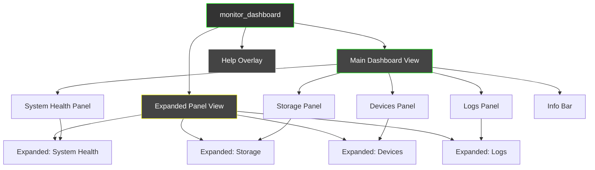
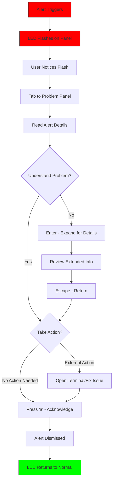
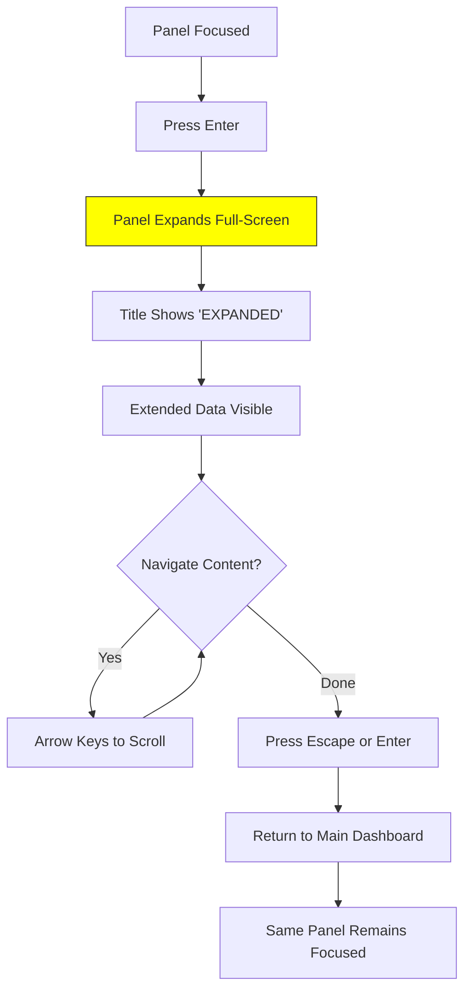
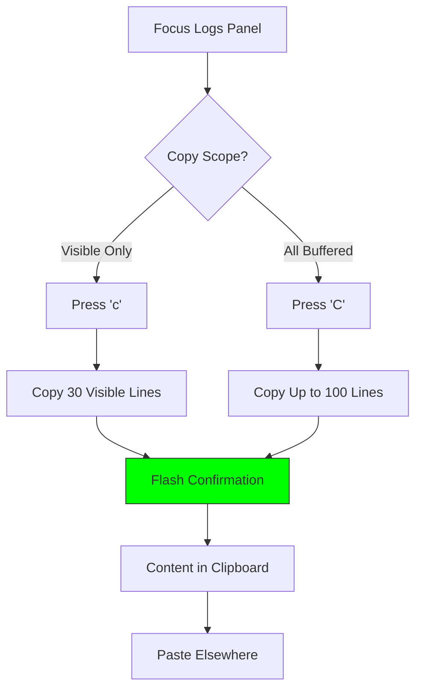
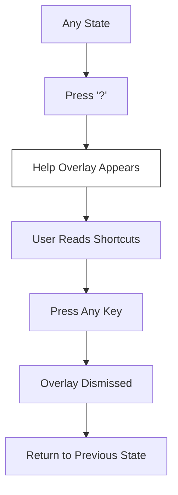

# monitor_dashboard UI/UX Specification

## Introduction

This document defines the user experience goals, information architecture, user flows, and visual design specifications for **monitor_dashboard**'s user interface. It serves as the foundation for visual design and frontend development, ensuring a cohesive and user-centered experience.

### Target User Personas

**Primary Persona: Developer/Power User**
- Technical professional who monitors their system while coding
- Values: efficiency, keyboard-driven interaction, information density
- Context: Dashboard runs in a tmux pane or terminal tab alongside work
- Needs: Quick glanceability, minimal distraction during normal operation, obvious alerts for problems

**Secondary Persona: Sysadmin/Tinkerer**
- Enthusiast who enjoys system monitoring and retro aesthetics
- Values: visual appeal, comprehensive information, customization potential
- Context: May run dashboard on multiple machines, appreciates the GEM aesthetic
- Needs: Detailed metrics, historical data, device battery tracking

### Usability Goals

| Goal | Measure |
|------|---------|
| **Glanceability** | User can assess system health in < 2 seconds |
| **Learnability** | All features discoverable via ? help in < 30 seconds |
| **Efficiency** | No mouse required; all actions via keyboard |
| **Error visibility** | Critical alerts noticed within 2 seconds |
| **Low cognitive load** | Fixed layout means no relearning panel positions |

### Design Principles

1. **Glanceability over detail** - The default view prioritizes quick health assessment; detail is available on demand via panel expansion
2. **Calm by default, urgent when needed** - Normal operation feels calm and stable; problems trigger immediate visual attention (flashing, color)
3. **Keyboard-native interaction** - Every action has a keyboard shortcut; no mouse required or expected
4. **Consistent visual language** - GEM aesthetic applied uniformly; server rack LEDs for status across all panels
5. **Respect terminal constraints** - Design within 80x24 minimum; use Unicode box-drawing; assume 256-color support

### Change Log

| Date | Version | Description | Author |
|------|---------|-------------|--------|
| 2026-01-16 | 0.1 | Initial front-end specification | Sally (UX) |

---

## Information Architecture (IA)

### Site Map / Screen Inventory

For a TUI dashboard, the "site map" is the panel layout and view hierarchy:



### Navigation Structure

**Primary Navigation: Panel Focus Cycling**
- `Tab` - Move focus to next panel (clockwise)
- `Shift+Tab` - Move focus to previous panel (counter-clockwise)
- Focus order: System Health → Storage → Devices → Logs → (repeat)
- Visual indicator: Highlighted border on focused panel

**Secondary Navigation: View Switching**
- `Enter` - Expand focused panel to full-screen view
- `Escape` or `Enter` - Return from expanded view to main dashboard
- `?` - Toggle help overlay
- `q` - Quit application

**Tertiary Navigation: Within-Panel Actions**
- `↑↓` - Scroll content within focused panel (logs, disk list)
- `c` / `C` - Copy actions (context-dependent, Logs panel)
- `a` / `A` - Alert acknowledgment

**Breadcrumb Strategy:** Not applicable for TUI. Current context indicated by:
- Panel title highlighting (focused panel)
- "EXPANDED" label in title bar when in expanded view
- Help overlay clearly labeled

### Panel Layout (Main Dashboard)

```
┌─────────────────────────────────────────────────────────────────────────────┐
│                              monitor_dashboard                               │
├─────────────────────────────────┬───────────────────────────────────────────┤
│  ● System Health               │  ● Storage                                │
│  ─────────────────────         │  ─────────────────────                    │
│  CPU [████████░░░░░░░] 53%     │  /     [████████████░░] 78%  234G/300G   │
│  ┌─────────────────────┐       │  /home [██████░░░░░░░░] 42%  210G/500G   │
│  │ ▁▂▃▄▅▆▇█▇▆▅▄▃▂▁▂▃▄ │       │  /var  [████░░░░░░░░░░] 28%   14G/50G   │
│  └─────────────────────┘       │                                           │
│  MEM [██████░░░░░░░░░] 41%     │                                           │
│  4.2 GB / 16 GB                │                                           │
│  Load: 1.24  0.98  0.87        │                                           │
├─────────────────────────────────┼───────────────────────────────────────────┤
│  ● Devices                     │  ● Logs (dmesg)                           │
│  ─────────────────────         │  ─────────────────────                    │
│  💻 Laptop Battery             │  14:23:01 [info] USB device connected     │
│  [████████████████░░] 89%      │  14:23:15 [warn] High temperature detected│
│  ⚡ Charging • 1h 12m to full  │  14:24:02 [info] Network interface up     │
│  ┌─────────────────────┐       │  14:24:33 [err ] Disk I/O error sector 42│
│  │ ▇▇▇▇▆▆▆▅▅▅▄▄▄▃▃▃▂▂ │       │  14:25:01 [info] Service started: docker │
│  └─────────────────────┘       │  14:25:44 [info] Bluetooth scan complete │
│                                │                                           │
│  🎧 Sony WH-1000XM4  [████] 85%│                                 [↑↓ scroll]│
│  🖱️ MX Master 3      [██░░] 42%│                                           │
├─────────────────────────────────┴───────────────────────────────────────────┤
│  2026-01-16 14:32:15 │ Up: 3d 14h 22m │ Kernel: 6.14.0-37 │ Ubuntu 24.04  │
└─────────────────────────────────────────────────────────────────────────────┘
```

---

## User Flows

### Flow 1: Passive Monitoring (Primary Use Case)

**User Goal:** Quickly assess system health while working on other tasks

**Entry Points:** Launch `monitor_dashboard` from terminal

**Success Criteria:** User confirms system is healthy in < 2 seconds without interaction

```mermaid
graph TD
    A[Launch App] --> B[Main Dashboard Loads]
    B --> C{Glance at LEDs}
    C -->|All Green| D[System OK - Continue Working]
    C -->|Yellow/Red| E[Focus on Problem Panel]
    E --> F[Read Details]
    F --> G{Need More Info?}
    G -->|Yes| H[Press Enter - Expand Panel]
    G -->|No| I[Acknowledge Alert if Needed]
    H --> J[View Extended Details]
    J --> K[Press Escape - Return]
    I --> D
    K --> D

    style C fill:#ff0,stroke:#333
    style D fill:#0f0,stroke:#333
```

**Edge Cases & Error Handling:**
- Terminal too small (< 80x24): Show warning message, attempt graceful degradation
- Data source unavailable: Show "N/A" in affected panel, don't crash
- Bluetooth unavailable: Show "No Bluetooth" message in Devices panel

**Notes:** This is the most common flow. User may never interact beyond launching the app.

---

### Flow 2: Alert Investigation

**User Goal:** Understand and respond to a system alert

**Entry Points:** Visual alert (flashing LED) catches attention

**Success Criteria:** User understands the problem and acknowledges the alert



**Edge Cases & Error Handling:**
- Multiple alerts: All are displayed; 'a' dismisses all, 'A' cycles through one by one
- Alert re-triggers: Hysteresis prevents immediate re-trigger after acknowledgment
- Bluetooth disconnect alert: Auto-clears if device reconnects

**Notes:** Alert colors: Red (critical), Yellow (warning). Flashing at 1-2 Hz.

---

### Flow 3: Panel Expansion

**User Goal:** View detailed information for a specific monitoring area

**Entry Points:** Press Enter while panel is focused

**Success Criteria:** User sees expanded view with additional detail



**Edge Cases & Error Handling:**
- Press Enter again in expanded view: Returns to dashboard (same as Escape)
- Data updates during expansion: Continue updating at 1 Hz
- No additional detail available: Show same content, just larger

**Notes:** Expanded view shows: longer history for charts, more log lines, full disk list.

---

### Flow 4: Copy Logs to Clipboard

**User Goal:** Copy log entries for sharing or analysis

**Entry Points:** Logs panel focused, press 'c' or 'C'

**Success Criteria:** Log content copied to system clipboard with confirmation



**Edge Cases & Error Handling:**
- Clipboard unavailable: Show error message "Clipboard unavailable", don't crash
- Empty logs: Copy empty string, show "No logs to copy"
- Very long messages: Include full message, not truncated version

**Notes:** Copied format includes timestamps and full messages.

---

### Flow 5: Getting Help

**User Goal:** Learn available keyboard shortcuts

**Entry Points:** Press '?' from any state

**Success Criteria:** User sees all shortcuts and can dismiss overlay



**Edge Cases & Error Handling:**
- Press '?' in expanded view: Overlay appears over expanded view
- Press '?' when help already open: Dismisses help (toggle behavior)

**Notes:** Help overlay is semi-transparent, showing shortcuts in organized groups.

---

## Wireframes & Mockups

**Primary Design Files:** ASCII wireframes in this document (TUI app - no Figma needed)

### Key Screen Layouts

#### Screen 1: Main Dashboard (Normal State)

**Purpose:** Primary view showing all monitoring panels at a glance

**Key Elements:**
- Title bar with application name
- 2x2 grid of monitoring panels
- LED status indicator (●) in each panel title
- Info bar footer with system details

**Interaction Notes:** Tab cycles focus (highlighted border), Enter expands

```
┌─────────────────────────────────────────────────────────────────────────────┐
│                              monitor_dashboard                               │
├─────────────────────────────────┬───────────────────────────────────────────┤
│ ● System Health                │ ● Storage                                 │
│ ───────────────────────────────│ ─────────────────────────────────────────│
│ CPU [████████████░░░░░░░] 62%  │ /     [██████████████░░] 82%   246G/300G │
│ ┌───────────────────────────┐  │ /home [████████░░░░░░░░] 52%   260G/500G │
│ │▁▂▃▄▅▆▇█▇▆▅▆▇█▇▆▅▄▃▄▅▆▇█▇▆│  │ /boot [██░░░░░░░░░░░░░░] 12%   120M/1G  │
│ └───────────────────────────┘  │ /tmp  [█░░░░░░░░░░░░░░░]  4%    42M/1G  │
│                                │                                          │
│ MEM [████████░░░░░░░░░░░] 42%  │                                          │
│ 6.7 GB / 16 GB                 │                                          │
│ ┌───────────────────────────┐  │                                          │
│ │▅▅▅▅▅▅▅▅▅▄▄▄▄▄▄▄▄▃▃▃▃▃▃▃▃▃│  │                                          │
│ └───────────────────────────┘  │                                          │
│                                │                                          │
│ Load: 2.14   1.87   1.52       │                                          │
│       1min   5min   15min      │                                          │
├─────────────────────────────────┼───────────────────────────────────────────┤
│ ● Devices                      │ ● Logs (dmesg)                           │
│ ───────────────────────────────│ ─────────────────────────────────────────│
│ 💻 Laptop Battery              │ 14:23:01 [info] USB device connected     │
│ [██████████████████░░░] 89%    │ 14:23:15 [WARN] High temperature on CPU  │
│ ⚡ Charging • 1h 12m to full   │ 14:24:02 [info] Network interface up     │
│ ┌───────────────────────────┐  │ 14:24:33 [ERR ] Disk I/O timeout sect 42 │
│ │▇▇▇▇▆▆▆▆▅▅▅▅▄▄▄▄▃▃▃▃▂▂▂▂▁▁│  │ 14:25:01 [info] Service started: docker │
│ └───────────────────────────┘  │ 14:25:44 [info] Bluetooth scan complete │
│                                │ 14:26:12 [info] Memory pressure normal  │
│ 🎧 Sony WH-1000XM4  [████░] 85%│ 14:26:55 [WARN] Swap usage increasing    │
│ 🖱️ Logitech MX 3    [██░░░] 42%│                              [↑↓ scroll] │
│ ⌨️ Keychron K2      [███░░] 67%│                                          │
├─────────────────────────────────┴───────────────────────────────────────────┤
│ 2026-01-16 14:32:15 │ Up: 3d 14h 22m │ Kernel: 6.14.0-37 │ Ubuntu 24.04   │
└─────────────────────────────────────────────────────────────────────────────┘
```

---

#### Screen 2: Main Dashboard (Alert State)

**Purpose:** Show visual alert when threshold exceeded

**Key Elements:**
- Flashing LED indicator (shown as `◉` vs `●`)
- Alert message bar at top or within panel
- Color change on affected metrics

**Interaction Notes:** Press 'a' to acknowledge, LED stops flashing

```
┌─────────────────────────────────────────────────────────────────────────────┐
│  ⚠️  ALERT: Battery low (18%) • CPU high (87%)           [a] to acknowledge │
├─────────────────────────────────────────────────────────────────────────────┤
│                              monitor_dashboard                               │
├─────────────────────────────────┬───────────────────────────────────────────┤
│ ◉ System Health        [!]     │ ● Storage                                 │
│ ───────────────────────────────│ ─────────────────────────────────────────│
│ CPU [██████████████████░] 87%  │ /     [██████████████░░] 82%   246G/300G │
│ ┌───────────────────────────┐  │ /home [████████░░░░░░░░] 52%   260G/500G │
│ │▅▆▇█████████████████████▇▆│  │                                          │
│ └───────────────────────────┘  │                                          │
│      ▲▲▲ HIGH CPU ▲▲▲          │                                          │
│                                │                                          │
├─────────────────────────────────┼───────────────────────────────────────────┤
│ ◉ Devices              [!]     │ ● Logs (dmesg)                           │
│ ───────────────────────────────│ ─────────────────────────────────────────│
│ 💻 Laptop Battery              │ 14:30:01 [WARN] Battery below 20%        │
│ [███░░░░░░░░░░░░░░░░░░] 18%    │ 14:30:15 [WARN] CPU temperature high     │
│ 🔋 Discharging • 28m remain    │ 14:30:22 [ERR ] Thermal throttling       │
│      ▲▲▲ LOW BATTERY ▲▲▲       │                                          │
└─────────────────────────────────┴───────────────────────────────────────────┘

◉ = Flashing LED (alternates with ○ at 1-2 Hz)
[!] = Alert indicator in panel title
```

---

#### Screen 3: Expanded Panel View (System Health)

**Purpose:** Full-screen detail view of single panel

**Key Elements:**
- "EXPANDED" indicator in title
- Larger charts with more history
- Additional detail not shown in compact view

**Interaction Notes:** Escape or Enter to return

```
┌─────────────────────────────────────────────────────────────────────────────┐
│                     ● System Health [EXPANDED]              [Enter] to close│
├─────────────────────────────────────────────────────────────────────────────┤
│                                                                             │
│  CPU Usage: 62%                                                             │
│  ┌─────────────────────────────────────────────────────────────────────┐   │
│  │                                                                     │   │
│  │    ▁▂▃▄▅▆▇█▇▆▅▆▇█▇▆▅▄▃▄▅▆▇█▇▆▅▄▃▂▁▂▃▄▅▆▇█▇▆▅▄▃▂▁▂▃▄▅▆▇█▇▆▅▄▃    │   │
│  │                                                                     │   │
│  └─────────────────────────────────────────────────────────────────────┘   │
│   -60s                           -30s                              now      │
│                                                                             │
│  Memory Usage: 6.7 GB / 16 GB (42%)                                        │
│  ┌─────────────────────────────────────────────────────────────────────┐   │
│  │                                                                     │   │
│  │    ▅▅▅▅▅▅▅▅▅▄▄▄▄▄▄▄▄▃▃▃▃▃▃▃▃▃▄▄▄▄▄▄▄▅▅▅▅▅▅▅▅▅▅▅▅▅▅▅▅▅▅▅▅▅▅▅▅▅    │   │
│  │                                                                     │   │
│  └─────────────────────────────────────────────────────────────────────┘   │
│   -60s                           -30s                              now      │
│                                                                             │
│  Load Average                                                               │
│  ├── 1 min:  2.14  [████████████░░░░░░░░░░░░░░░░░░]                        │
│  ├── 5 min:  1.87  [██████████░░░░░░░░░░░░░░░░░░░░]                        │
│  └── 15 min: 1.52  [████████░░░░░░░░░░░░░░░░░░░░░░]                        │
│                                                                             │
│  Per-CPU Usage:                                                             │
│  CPU0 [████████████░░░░] 71%   CPU1 [██████████░░░░░░] 58%                 │
│  CPU2 [████████░░░░░░░░] 45%   CPU3 [██████████████░░] 82%                 │
│                                                                             │
├─────────────────────────────────────────────────────────────────────────────┤
│ 2026-01-16 14:32:15 │ Up: 3d 14h 22m │ Kernel: 6.14.0-37 │ Ubuntu 24.04   │
└─────────────────────────────────────────────────────────────────────────────┘
```

---

#### Screen 4: Help Overlay

**Purpose:** Show all available keyboard shortcuts

**Key Elements:**
- Semi-transparent overlay effect (lighter background)
- Organized shortcut groups
- Dismiss instruction at bottom

**Interaction Notes:** Any keypress dismisses

```
┌─────────────────────────────────────────────────────────────────────────────┐
│                              monitor_dashboard                               │
├──────────────────┬──────────────────────────────────────────────────────────┤
│ ░░░░░░░░░░░░░░░░░│░░░░░░░░░░░░░░░░░░░░░░░░░░░░░░░░░░░░░░░░░░░░░░░░░░░░░░░░│
│ ░░░░░░░░░░░░░░░░░│░┌─────────────────────────────────────────────────┐░░░░│
│ ░░░░░░░░░░░░░░░░░│░│              KEYBOARD SHORTCUTS                 │░░░░│
│ ░░░░░░░░░░░░░░░░░│░├─────────────────────────────────────────────────┤░░░░│
│ ░░░░░░░░░░░░░░░░░│░│                                                 │░░░░│
│ ░░░░░░░░░░░░░░░░░│░│  NAVIGATION                                     │░░░░│
│ ░░░░░░░░░░░░░░░░░│░│  Tab ............ Next panel                    │░░░░│
│ ░░░░░░░░░░░░░░░░░│░│  Shift+Tab ...... Previous panel                │░░░░│
│ ░░░░░░░░░░░░░░░░░│░│  ↑↓ ............. Scroll within panel           │░░░░│
├──────────────────┼░│                                                 │░░░░│
│ ░░░░░░░░░░░░░░░░░│░│  VIEWS                                          │░░░░│
│ ░░░░░░░░░░░░░░░░░│░│  Enter .......... Expand/collapse panel         │░░░░│
│ ░░░░░░░░░░░░░░░░░│░│  Escape ......... Return to dashboard           │░░░░│
│ ░░░░░░░░░░░░░░░░░│░│  ? .............. Toggle this help              │░░░░│
│ ░░░░░░░░░░░░░░░░░│░│                                                 │░░░░│
│ ░░░░░░░░░░░░░░░░░│░│  ACTIONS                                        │░░░░│
│ ░░░░░░░░░░░░░░░░░│░│  a .............. Acknowledge all alerts        │░░░░│
│ ░░░░░░░░░░░░░░░░░│░│  A .............. Acknowledge one alert         │░░░░│
│ ░░░░░░░░░░░░░░░░░│░│  c .............. Copy visible logs             │░░░░│
│ ░░░░░░░░░░░░░░░░░│░│  C .............. Copy all logs                 │░░░░│
│ ░░░░░░░░░░░░░░░░░│░│  q .............. Quit                          │░░░░│
│ ░░░░░░░░░░░░░░░░░│░│                                                 │░░░░│
│ ░░░░░░░░░░░░░░░░░│░│              Press any key to close             │░░░░│
│ ░░░░░░░░░░░░░░░░░│░└─────────────────────────────────────────────────┘░░░░│
├──────────────────┴──────────────────────────────────────────────────────────┤
│ ░░░░░░░░░░░░░░░░░░░░░░░░░░░░░░░░░░░░░░░░░░░░░░░░░░░░░░░░░░░░░░░░░░░░░░░░░░│
└─────────────────────────────────────────────────────────────────────────────┘

░ = Dimmed background (underlying dashboard still visible)
```

---

## Component Library / Design System

**Design System Approach:** Custom TUI component library built with Python's `textual` framework, following GEM desktop aesthetic with server rack LED indicators. Components are designed for monospace terminal rendering with Unicode box-drawing characters.

### Design System Principles

| Principle | Implementation |
|-----------|----------------|
| **Consistent borders** | All panels use identical box-drawing characters (┌┐└┘├┤┬┴┼─│) |
| **LED convention** | Status always indicated via ● (normal), ◉ (alert), ○ (off/inactive) |
| **Color semantics** | Green=healthy, Yellow=warning, Red=critical, White=neutral |
| **Fixed proportions** | Components use character-based sizing, not percentages |
| **Monospace typography** | Single font assumed; emphasis via UPPERCASE, bold (if supported), or color |

---

### Core Components

#### 1. Panel

**Purpose:** Container for all dashboard sections; provides visual grouping, title, and status indication

**Variants:**
- `Panel.default` - Standard 2x2 grid panel
- `Panel.expanded` - Full-screen mode with "EXPANDED" indicator
- `Panel.focused` - Highlighted border (double-line or color change)
- `Panel.alert` - Flashing LED, alert styling

**States:**
- Normal (green LED ●)
- Warning (yellow LED ●)
- Critical (red LED ●, flashing ◉↔○)
- Focused (highlighted border)
- Disabled (dimmed content, gray LED)

**Usage Guidelines:**
- Always include LED indicator in title bar
- Title left-aligned after LED
- Content area respects 1-character padding
- Border uses single-line box-drawing by default, double-line when focused

```
┌─ ● Panel Title ──────────────┐     ╔═ ● Panel Title [FOCUSED] ═════╗
│                              │     ║                                ║
│  [Content Area]              │     ║  [Content Area]                ║
│                              │     ║                                ║
└──────────────────────────────┘     ╚════════════════════════════════╝
```

---

#### 2. ProgressBar

**Purpose:** Display percentage values (CPU, memory, disk usage) with filled/empty segments

**Variants:**
- `ProgressBar.horizontal` - Standard left-to-right fill
- `ProgressBar.labeled` - Includes percentage label at end
- `ProgressBar.compact` - Shorter width for tight spaces

**States:**
- Normal (green fill when < 70%)
- Warning (yellow fill when 70-90%)
- Critical (red fill when > 90%)
- Alert threshold states invert for "low is bad" metrics (battery, free disk)

**Usage Guidelines:**
- Use `█` for filled, `░` for empty segments
- Always show percentage number after bar
- Width should be consistent within same panel
- Include unit context where helpful (e.g., "6.7 GB / 16 GB")

```
Normal:   [████████░░░░░░░░░░░] 42%
Warning:  [██████████████░░░░░] 73%
Critical: [██████████████████░] 94%
Battery:  [██░░░░░░░░░░░░░░░░░] 12%  ← Red (low is bad)
```

---

#### 3. HistoryChart (Sparkline)

**Purpose:** Display time-series data as a mini chart showing trends

**Variants:**
- `HistoryChart.sparkline` - Single row using block characters (▁▂▃▄▅▆▇█)
- `HistoryChart.expanded` - Multi-row chart with axis labels (expanded view only)

**States:**
- Normal (green/cyan color)
- Warning (yellow when recent values exceed warning threshold)
- Critical (red when recent values exceed critical threshold)

**Usage Guidelines:**
- Use 8-level block characters: ▁▂▃▄▅▆▇█
- Width matches container; typically 20-40 characters
- Most recent data on right edge
- Enclosed in mini-border for visual separation
- In expanded view, add time axis labels (-60s, -30s, now)

```
Compact:   ┌───────────────────────────┐
           │▁▂▃▄▅▆▇█▇▆▅▆▇█▇▆▅▄▃▄▅▆▇█▇▆│
           └───────────────────────────┘

Expanded:  ┌─────────────────────────────────────────────────────────────────────┐
           │                                                                     │
           │    ▁▂▃▄▅▆▇█▇▆▅▆▇█▇▆▅▄▃▄▅▆▇█▇▆▅▄▃▂▁▂▃▄▅▆▇█▇▆▅▄▃▂▁▂▃▄▅▆▇█▇▆▅▄▃    │
           │                                                                     │
           └─────────────────────────────────────────────────────────────────────┘
            -60s                           -30s                              now
```

---

#### 4. LEDIndicator

**Purpose:** Provide at-a-glance status via colored dot, inspired by server rack LEDs

**Variants:**
- `LED.status` - Panel health indicator (in title bar)
- `LED.inline` - Within content (service status, device status)

**States:**
- Healthy: `●` green
- Warning: `●` yellow
- Critical: `●` red
- Flashing: alternates `◉` ↔ `○` at 1-2 Hz
- Inactive: `○` gray
- Unknown: `●` gray

**Usage Guidelines:**
- Always positioned before text label
- Single space between LED and label
- Flashing implemented via timer-based redraw
- Color applied via textual CSS or Rich markup

```
● Running       (green)
● High Load     (yellow)
● Failed        (red)
◉ CRITICAL      (flashing red)
○ Stopped       (gray)
```

---

#### 5. DeviceListItem

**Purpose:** Display Bluetooth/peripheral device with name, icon, and battery level

**Variants:**
- `DeviceListItem.battery` - Includes battery bar
- `DeviceListItem.simple` - Name and status only (for devices without battery)

**States:**
- Connected (normal display)
- Disconnected (dimmed, strikethrough or grayed)
- Low battery (red battery bar, may trigger alert)
- Charging (⚡ icon, animated if possible)

**Usage Guidelines:**
- Use emoji icons sparingly: 🎧 💻 🖱️ ⌨️
- Battery bar compact: 5 characters [████░]
- Percentage after bar
- Device name truncated with ellipsis if too long

```
💻 Laptop Battery              🎧 Sony WH-1000XM4  [████░] 85%
[██████████████████░░░] 89%    🖱️ Logitech MX 3    [██░░░] 42%
⚡ Charging • 1h 12m to full   ⌨️ Keychron K2      [███░░] 67%
```

---

#### 6. LogEntry

**Purpose:** Display single log line with timestamp, severity, and message

**Variants:**
- `LogEntry.compact` - Timestamp + severity badge + truncated message
- `LogEntry.full` - Complete message (expanded view or clipboard)

**States:**
- Info (default/cyan)
- Warning (yellow, [WARN] badge)
- Error (red, [ERR ] badge)
- Debug (gray, [DBG ] badge, if enabled)

**Usage Guidelines:**
- Fixed-width timestamp: `HH:MM:SS`
- Fixed-width severity badge: 6 characters including brackets
- Message fills remaining width, truncated with `…` if needed
- Severity colors applied to entire line or badge only

```
14:23:01 [info] USB device connected
14:23:15 [WARN] High temperature detected on CPU
14:24:33 [ERR ] Disk I/O timeout on sector 42
14:25:01 [info] Service started: docker
```

---

#### 7. InfoBar

**Purpose:** Footer bar displaying static system information

**Variants:**
- `InfoBar.default` - Single row with pipe separators

**States:**
- Normal (all info displayed)
- Alert (may flash or highlight if critical system info)

**Usage Guidelines:**
- Spans full width of terminal
- Items separated by ` │ ` (space-pipe-space)
- Left-to-right priority: Date/time, Uptime, Kernel, Distro
- Truncate from right if terminal too narrow

```
2026-01-16 14:32:15 │ Up: 3d 14h 22m │ Kernel: 6.14.0-37 │ Ubuntu 24.04
```

---

#### 8. AlertBanner

**Purpose:** Prominent banner showing active alerts at top of screen

**Variants:**
- `AlertBanner.single` - One alert message
- `AlertBanner.multi` - Multiple alerts, scrollable or summarized

**States:**
- Warning (yellow background)
- Critical (red background, may flash)
- Acknowledged (dimmed until cleared)

**Usage Guidelines:**
- Only visible when alerts are active
- Includes dismiss hint: `[a] to acknowledge`
- Shows alert count if multiple
- Disappears after acknowledgment

```
┌─────────────────────────────────────────────────────────────────────────────┐
│  ⚠️  ALERT: Battery low (18%) • CPU high (87%)           [a] to acknowledge │
└─────────────────────────────────────────────────────────────────────────────┘
```

---

#### 9. HelpOverlay

**Purpose:** Modal overlay showing keyboard shortcuts

**Variants:**
- `HelpOverlay.default` - Centered overlay with grouped shortcuts

**States:**
- Visible (any key dismisses)
- Hidden (default)

**Usage Guidelines:**
- Semi-transparent effect via dimmed background (░ characters or color)
- Centered box with KEYBOARD SHORTCUTS title
- Shortcuts grouped by function (Navigation, Views, Actions)
- Dismiss instruction at bottom

---

### Component Composition Examples

**Panel with ProgressBar and HistoryChart:**
```
┌─ ● System Health ────────────────┐
│ CPU [████████░░░░░░░░░░░] 42%    │
│ ┌───────────────────────────┐    │
│ │▁▂▃▄▅▆▇█▇▆▅▆▇█▇▆▅▄▃▄▅▆▇█▇▆│    │
│ └───────────────────────────┘    │
│                                  │
│ MEM [██████████░░░░░░░░░] 52%    │
│ 8.3 GB / 16 GB                   │
└──────────────────────────────────┘
```

---

## Branding & Style Guide

### Visual Identity

**Brand Guidelines:** GEM Desktop Environment aesthetic (1985-1990s era), combined with modern server rack status indicators. No formal corporate brand; visual identity is defined by this specification.

**Reference Materials:** `images/gem/` directory contains 10 reference screenshots demonstrating:
- Bordered windows with title bars
- Drop shadow effects on window edges
- Monochrome base with limited color accents
- Clean geometric forms and sharp pixel edges
- Simple iconography

**Design Philosophy:**
- **Retro-functional**: Aesthetic serves purpose (clarity, glanceability) not just nostalgia
- **Terminal-native**: Design assumes 80x24 minimum, monospace font, 256-color support
- **Server room inspiration**: LED indicators evoke data center monitoring equipment

---

### Color Palette

Terminal colors using standard 256-color palette for maximum compatibility:

| Color Role | Name | ANSI Code | Hex (approx) | Usage |
|------------|------|-----------|--------------|-------|
| **Background** | Black | 0 | `#000000` | Main background, panel interiors |
| **Foreground** | White | 15 | `#FFFFFF` | Primary text, borders |
| **Primary** | Green | 2 / 10 | `#00AA00` / `#55FF55` | Healthy status, normal LEDs, OK values |
| **Warning** | Yellow | 3 / 11 | `#AA5500` / `#FFFF55` | Warning status, threshold approaching |
| **Critical** | Red | 1 / 9 | `#AA0000` / `#FF5555` | Error status, threshold exceeded |
| **Info** | Cyan | 6 / 14 | `#00AAAA` / `#55FFFF` | Informational text, links, log info |
| **Muted** | Gray | 8 | `#555555` | Disabled items, less important text |
| **Accent** | Blue | 4 / 12 | `#0000AA` / `#5555FF` | Focus highlights, selection |

**Color Usage Rules:**
1. **Green = Good**: Use for values within normal range, healthy LEDs
2. **Yellow = Attention**: Use for values approaching threshold, warnings
3. **Red = Action Needed**: Use for values exceeding threshold, errors
4. **White = Neutral**: Default text, borders, structural elements
5. **Gray = Diminished**: Disabled states, secondary information
6. **Cyan = Informational**: Log info level, help text, non-critical status

**Accessibility Note:** Color is never the only indicator; always paired with:
- Text labels (OK, WARN, ERR)
- Shape changes (● vs ◉ vs ○)
- Position (alert banner at top)

---

### Typography

**Font Families:**
- **Primary:** System monospace (terminal default)
- **Secondary:** N/A (single font in TUI)
- **Monospace:** Assumed for all text

**Font Rendering:**
TUI applications inherit terminal font settings. Recommended user fonts:
- JetBrains Mono
- Fira Code
- Source Code Pro
- Ubuntu Mono
- Any monospace with Unicode block character support

**Text Emphasis Techniques:**

| Technique | Usage | Example |
|-----------|-------|---------|
| **UPPERCASE** | Severity badges, alerts | `[WARN]`, `[ERR ]`, `EXPANDED` |
| **Color** | Status indication | Green for OK, Red for error |
| **Bold** | Panel titles (if terminal supports) | `● System Health` |
| **Dim** | Disabled/secondary text | Grayed out items |
| **Reverse** | Selection highlight | Inverted colors |

**Type Scale:**
Not applicable in traditional sense. All text is single-size monospace. Hierarchy achieved through:
- Position (top = title, bottom = footer)
- Color (bright = important, dim = secondary)
- Characters (─── dividers, ● indicators)

---

### Iconography

**Icon Library:** Unicode characters and select emoji

**Structural Icons (Box Drawing):**
```
┌ ┐ └ ┘  - Corners
─ │      - Lines
├ ┤ ┬ ┴ ┼ - Intersections
╔ ╗ ╚ ╝ ║ ═ - Double-line (focus state)
```

**Status Icons:**
```
●  - LED on (colored by state)
○  - LED off / inactive
◉  - LED alert (flashing)
▲  - Warning indicator
⚠️  - Alert (emoji, use sparingly)
```

**Device Icons (Emoji):**
```
💻  - Laptop / computer
🎧  - Headphones / audio device
🖱️  - Mouse
⌨️  - Keyboard
🔋  - Battery (general)
⚡  - Charging / power
```

**Data Visualization:**
```
█ ░  - Progress bar fill/empty
▁▂▃▄▅▆▇█  - Sparkline levels (8 heights)
↑ ↓  - Scroll indicators
```

**Icon Usage Guidelines:**
1. Prefer Unicode over emoji for consistency
2. Emoji used only for device identification (recognizability)
3. Box-drawing characters for all structural elements
4. Status always via ● LED convention, not emoji
5. Test icon rendering in target terminal emulators

---

### Spacing & Layout

**Grid System:** Character-based grid (not pixel-based)

| Element | Specification |
|---------|---------------|
| Minimum terminal | 80 columns × 24 rows |
| Target terminal | 120 columns × 40 rows |
| Panel padding | 1 character on all sides |
| Panel margin | 0 (panels share borders) |
| Label spacing | 1 space between LED and text |
| Section divider | Full-width `───` line |

**Layout Proportions (80-column mode):**
```
┌─────────────────────────────────────┬──────────────────────────────────────┐
│         Panel 1 (39 cols)          │         Panel 2 (39 cols)           │
│         ~18 rows                    │         ~18 rows                     │
├─────────────────────────────────────┼──────────────────────────────────────┤
│         Panel 3 (39 cols)          │         Panel 4 (39 cols)           │
│         ~18 rows                    │         ~18 rows                     │
├─────────────────────────────────────┴──────────────────────────────────────┤
│                           Info Bar (80 cols, 1 row)                        │
└────────────────────────────────────────────────────────────────────────────┘
```

**Spacing Scale:**
- **0 chars** - No space (adjacent elements)
- **1 char** - Standard spacing (LED to label, bar to percentage)
- **2 chars** - Section separation within panel
- **Full row** - Major section separation (divider line)

**Alignment Rules:**
- Panel titles: Left-aligned after LED
- Numeric values: Right-aligned within fixed width
- Labels: Left-aligned
- Progress bars: Left-aligned, fixed width per panel
- Info bar items: Pipe-separated, centered overall

---

## Accessibility Requirements

### Compliance Target

**Standard:** Adapted WCAG 2.1 AA principles for terminal user interface

Traditional web accessibility standards (WCAG) don't directly apply to TUI applications, but their principles guide our approach:
- **Perceivable** - Information presented in ways users can perceive
- **Operable** - Interface operable via keyboard
- **Understandable** - Information and operation understandable
- **Robust** - Content works with assistive technologies where possible

---

### Key Requirements

#### Visual Accessibility

**Color Contrast:**
- Foreground text (white) on background (black): ~21:1 ratio (exceeds AA)
- Green on black: ~5:1 ratio (passes AA for normal text)
- Yellow on black: ~10:1 ratio (passes AA)
- Red on black: ~4:1 ratio (passes AA for large text; paired with labels)
- All status colors paired with text labels for redundancy

**Color Independence:**
- Status never conveyed by color alone
- LED indicators use shape variation: ● (on), ○ (off), ◉ (flashing)
- Severity badges use text: `[info]`, `[WARN]`, `[ERR ]`
- Alert banner uses position (top of screen) + text + color

**Color Blindness Considerations:**

| Condition | Challenge | Mitigation |
|-----------|-----------|------------|
| Protanopia (red-blind) | Red/green confusion | Text labels always present; position indicates severity |
| Deuteranopia (green-blind) | Red/green confusion | Same as above |
| Tritanopia (blue-yellow-blind) | Yellow/blue confusion | Yellow warnings include [WARN] text; blue used only for focus |

**Focus Indicators:**
- Focused panel has visually distinct border (double-line or bright color)
- Focus clearly visible against all panel states
- Focus indicator is 2+ characters wide (border thickness)

**Text Sizing:**
- TUI inherits terminal font size (user-configurable in terminal settings)
- No fixed pixel sizes; users control via terminal preferences
- Minimum recommended: 12pt equivalent in user's terminal

---

#### Interaction Accessibility

**Keyboard Navigation:**
- 100% keyboard accessible - no mouse required
- All interactive elements reachable via Tab/Shift+Tab
- Logical focus order: top-left → top-right → bottom-left → bottom-right
- Focus trapped within help overlay when open
- Escape always returns to previous state

**Keyboard Shortcuts:**

| Key | Action | Notes |
|-----|--------|-------|
| Tab | Next panel | Cycles clockwise |
| Shift+Tab | Previous panel | Cycles counter-clockwise |
| Enter | Expand/collapse | Context-dependent |
| Escape | Return/dismiss | Always safe to press |
| ? | Toggle help | Available from any state |
| q | Quit | Single keypress exit |
| a/A | Acknowledge alerts | Available when alerts active |
| c/C | Copy logs | Available when Logs panel focused |
| ↑↓ | Scroll | Within scrollable panels |

**No Timing Dependencies:**
- 1 Hz refresh is passive; no user action required
- Alert flashing is visual indicator, not timed interaction
- No timeouts that force user action
- Alerts persist until user acknowledges (no auto-dismiss)

**Error Prevention:**
- No destructive actions without confirmation
- Quit (q) exits cleanly without data loss
- Acknowledge (a) is reversible (alert re-triggers if condition persists)

---

#### Content Accessibility

**Alternative Text:**
- N/A for TUI (no images)
- Charts use text labels alongside visual representation
- Example: `CPU [████████░░░░░░░░░░░] 42%` - percentage readable even if bars unclear

**Heading Structure:**
- Panel titles serve as headings
- Consistent title format: `● Panel Name`
- Help overlay uses clear section headings (NAVIGATION, VIEWS, ACTIONS)

**Form Labels:**
- N/A (no form inputs in current design)
- Future config editing would require labeled fields

**Readable Content:**
- Log messages show full text (truncated with `…` indicator)
- Timestamps in consistent format (HH:MM:SS)
- Metric values include units (GB, %, etc.)
- Abbreviations avoided or explained in help

---

#### Screen Reader Considerations

**Current Limitations:**
TUI applications have limited screen reader support compared to web/GUI applications. Terminal screen readers (like BRLTTY or terminal-specific accessibility modes) may work but are not guaranteed.

**Mitigations:**
- All information is text-based (no graphics)
- Status conveyed via text labels, not just symbols
- Logical reading order (top-to-bottom, left-to-right within panels)
- Help overlay documents all shortcuts

**Future Consideration:**
- Investigate textual framework's accessibility features
- Consider optional "screen reader mode" that outputs simplified text
- Explore terminal bell/audio alerts as supplement to visual flashing

---

### Testing Strategy

**Manual Testing:**

| Test | Method | Pass Criteria |
|------|--------|---------------|
| Keyboard-only use | Unplug mouse, navigate all features | All features accessible |
| Color blindness | Use colorblind simulation (e.g., Color Oracle) | Status distinguishable without color |
| High contrast | Test with high-contrast terminal theme | All elements visible |
| Large text | Increase terminal font to 24pt | Layout remains usable |
| Small terminal | Resize to 80x24 minimum | Graceful degradation or clear error |

**Automated Testing:**
- Unit tests for keyboard navigation state machine
- Integration tests verify focus order
- Contrast ratios verified in style documentation (above)

**User Testing:**
- Recruit users with color vision deficiency for feedback
- Test with users who prefer keyboard-only interaction
- Gather feedback on alert visibility and acknowledgment flow

---

## Responsiveness Strategy

### Design Decision: Fixed Layout

**Approach:** Fixed layout with minimum terminal size requirement

Unlike web/mobile applications that adapt to various screen sizes, monitor_dashboard uses a **fixed layout** by design. This decision was made during brainstorming for the following reasons:

1. **Predictability**: Users always know where to look for specific information
2. **Reduced cognitive load**: No need to relearn layout at different sizes
3. **Glanceability**: Muscle memory develops for quick status checks
4. **Implementation simplicity**: Single layout to test and maintain
5. **Terminal context**: Users typically run dashboard in dedicated tmux pane or terminal tab with consistent size

---

### Terminal Size Requirements

| Requirement | Columns | Rows | Notes |
|-------------|---------|------|-------|
| **Minimum** | 80 | 24 | Classic terminal standard; hard requirement |
| **Recommended** | 120 | 40 | Comfortable viewing with all details visible |
| **Optimal** | 160 | 50 | Expanded view shows maximum history |

**Minimum Size Breakdown (80×24):**
```
Row allocation:
- Title bar: 1 row
- Top panels: 9 rows each (shared border)
- Panel divider: 1 row
- Bottom panels: 9 rows each (shared border)
- Info bar: 1 row
- Bottom border: 1 row
Total: 24 rows

Column allocation:
- Left border: 1 col
- Left panels: 38 cols
- Center divider: 2 cols
- Right panels: 38 cols
- Right border: 1 col
Total: 80 cols
```

---

### Behavior at Different Sizes

#### Below Minimum (< 80×24)

**Behavior:** Display error message, do not attempt to render dashboard

```
┌─────────────────────────────────────────┐
│                                         │
│   Terminal too small                    │
│                                         │
│   Required: 80 × 24                     │
│   Current:  72 × 20                     │
│                                         │
│   Please resize your terminal           │
│   or press 'q' to quit                  │
│                                         │
└─────────────────────────────────────────┘
```

**Rationale:** Attempting to render a degraded view would compromise the dashboard's core value (glanceability). Better to clearly communicate the requirement.

---

#### At Minimum (80×24)

**Behavior:** Full dashboard with compact content

- All four panels visible
- Progress bars: 20 characters wide
- History charts: 20 data points
- Logs: ~6 lines visible
- Device list: ~3 devices visible
- Info bar: May truncate distro name

---

#### Above Minimum (> 80×24)

**Behavior:** Extra space used for enhanced content, not layout changes

| Extra Space | Usage |
|-------------|-------|
| +columns | Wider progress bars, longer log messages, more history points |
| +rows | More log lines visible, more devices listed, taller charts |

**Layout remains fixed 2×2 grid** - panels grow proportionally but don't reflow.

---

#### Expanded Panel View

**Behavior:** Single panel fills available terminal space

- Expanded view always uses full terminal dimensions
- More detail shown: longer history, more log lines, per-CPU stats
- Returns to normal view preserving terminal size awareness

---

### Adaptation Patterns

**Layout Changes:** None - fixed 2×2 grid at all sizes

**Navigation Changes:** None - same keyboard shortcuts at all sizes

**Content Priority:** All panels equally prioritized; no content hidden at smaller sizes

**Interaction Changes:** None - same interaction model regardless of size

---

### Resize Handling

**Runtime Resize Detection:**
- Application detects terminal resize events (SIGWINCH)
- If resize results in < 80×24: show size error, pause updates
- If resize results in ≥ 80×24: redraw at new size immediately
- Data collection continues during resize; no data loss

**Textual Framework Support:**
- textual handles resize events automatically
- CSS-like sizing (fr units, percentages) adapts content to available space
- Minimum size check implemented in application startup and resize handler

---

### Not Applicable Sections

The following traditional responsive design concepts do not apply:

| Concept | Reason Not Applicable |
|---------|----------------------|
| **Breakpoints** | Single fixed layout, no reflow |
| **Mobile-first** | TUI is desktop/terminal only |
| **Touch adaptation** | Keyboard-only interaction |
| **Orientation** | Terminals don't rotate |
| **Viewport units** | Character-based sizing instead |
| **Media queries** | No CSS in traditional sense |

---

## Animation & Micro-interactions

### Motion Principles

TUI animation differs fundamentally from web/mobile animation. Rather than smooth transitions measured in milliseconds, TUI motion occurs through discrete character updates at defined intervals.

**Core Principles:**

1. **Purposeful motion only** - Animation serves function (alert attention, confirm action), never decoration
2. **Respect the 1 Hz rhythm** - Data updates at 1 Hz; animations align with this cadence
3. **Character-based transitions** - No pixel interpolation; states change discretely
4. **Minimal CPU impact** - Animation must not compete with system monitoring
5. **User-interruptible** - Any animation can be interrupted by user input

---

### Key Animations

#### 1. Alert LED Flash

**Purpose:** Draw immediate attention to critical system state

**Description:** LED indicator alternates between filled and empty states

**Timing:**
- Duration: Continuous until acknowledged
- Frequency: 2 Hz (alternates every 500ms)
- Pattern: `◉` → `○` → `◉` → `○` ...

**States:**
```
Frame 1 (0ms):    ◉ System Health    [!]     (bright red, filled)
Frame 2 (500ms):  ○ System Health    [!]     (dim red, empty)
Frame 3 (1000ms): ◉ System Health    [!]     (bright red, filled)
...continues until 'a' pressed...
```

**Easing:** N/A (binary toggle)

**Implementation Notes:**
- Use textual's `set_interval()` for timing
- Flash state stored in component; survives data refresh
- Multiple panels can flash simultaneously
- Flash stops immediately on acknowledgment (no fade out)

---

#### 2. Data Refresh Pulse

**Purpose:** Subtle indication that data is live and updating

**Description:** Brief highlight on changed values during 1 Hz refresh

**Timing:**
- Duration: 200ms highlight, then return to normal
- Frequency: Triggered on each data update (1 Hz)
- Pattern: Normal → Bright → Normal

**States:**
```
CPU value changes from 42% to 45%:
  Frame 1 (0ms):    CPU [████████░░░] 45%   (bright white text)
  Frame 2 (200ms):  CPU [████████░░░] 45%   (normal white text)
```

**Easing:** Instant on, instant off

**Implementation Notes:**
- Only highlight values that changed, not entire panel
- Subtle effect; users may not consciously notice but it adds "aliveness"
- Can be disabled in future config if distracting
- Consider skipping if value change is < threshold (e.g., 1% CPU fluctuation)

---

#### 3. Focus Transition

**Purpose:** Clearly indicate which panel is now focused

**Description:** Border style changes when focus moves between panels

**Timing:**
- Duration: Instant (single frame)
- Frequency: On Tab/Shift+Tab keypress

**States:**
```
Before Tab:
┌─ ● System Health ─────┐     ┌─ ● Storage ────────────┐
│  [focused - double]   │     │  [unfocused - single]  │

After Tab:
┌─ ● System Health ─────┐     ╔═ ● Storage ════════════╗
│  [unfocused - single] │     ║  [focused - double]    ║
```

**Easing:** Instant (no interpolation)

**Implementation Notes:**
- Border change is immediate; no animation needed
- Textual CSS classes: `.panel` vs `.panel:focus`
- Focus ring color may also change (e.g., blue highlight)

---

#### 4. Panel Expand/Collapse

**Purpose:** Transition between dashboard view and expanded panel view

**Description:** Selected panel grows to fill screen; others disappear

**Timing:**
- Duration: Instant (single frame redraw)
- Frequency: On Enter keypress

**States:**
```
Before Enter (dashboard view):
┌────────┬────────┐
│ Panel1 │ Panel2 │
├────────┼────────┤
│ Panel3 │ Panel4 │
└────────┴────────┘

After Enter (expanded view):
┌─────────────────────────────────────┐
│         Panel1 [EXPANDED]           │
│                                     │
│         (full detail content)       │
│                                     │
└─────────────────────────────────────┘
```

**Easing:** Instant

**Implementation Notes:**
- No slide or zoom animation; instant state change
- Textual screens or visibility toggling
- Expanded panel receives full terminal dimensions
- Data continues updating during expanded view

---

#### 5. Help Overlay Appear/Dismiss

**Purpose:** Show/hide keyboard shortcuts reference

**Description:** Modal overlay appears over dashboard content

**Timing:**
- Duration: Instant appear, instant dismiss
- Frequency: On `?` keypress (toggle)

**States:**
```
Before ? (normal view):
┌────────┬────────┐
│ Panel1 │ Panel2 │
├────────┼────────┤
│ Panel3 │ Panel4 │
└────────┴────────┘

After ? (overlay visible):
┌────────┬────────┐
│ ░░░░░░ │ ░░░░░░ │
│ ░┌──────────┐░░ │
│ ░│  HELP    │░░ │
│ ░└──────────┘░░ │
└────────┴────────┘
```

**Easing:** Instant

**Implementation Notes:**
- Overlay is separate layer; dashboard continues updating behind dimmed area
- Any keypress dismisses (not just `?` or Escape)
- Consider capturing first keypress to avoid accidental action

---

#### 6. Copy Confirmation Flash

**Purpose:** Confirm clipboard copy action succeeded

**Description:** Brief visual feedback when logs are copied

**Timing:**
- Duration: 500ms
- Frequency: On `c` or `C` keypress in Logs panel

**States:**
```
Frame 1 (0ms):    │ ✓ Copied 30 lines to clipboard │  (green background)
Frame 2 (500ms):  │ ● Logs (dmesg)                 │  (normal panel title)
```

**Easing:** Instant on, instant off

**Implementation Notes:**
- Temporarily replace panel title with confirmation message
- Green background/text for success
- If clipboard fails, show error message in red instead
- Message auto-dismisses; no user action required

---

#### 7. Sparkline Data Shift

**Purpose:** Visualize new data point entering history chart

**Description:** Chart data shifts left as new point added on right

**Timing:**
- Duration: Instant (part of 1 Hz refresh)
- Frequency: Every data refresh (1 Hz)

**States:**
```
Frame 1:  │▁▂▃▄▅▆▇█▇▆▅▄▃▂▁▂▃▄│  (current)
Frame 2:  │▂▃▄▅▆▇█▇▆▅▄▃▂▁▂▃▄▅│  (shifted left, new value on right)
```

**Easing:** Instant

**Implementation Notes:**
- Data stored in circular buffer or deque
- Oldest value dropped, newest value appended
- No scrolling animation; instant redraw with shifted data
- Chart width determines number of visible data points

---

### Animation Summary Table

| Animation | Trigger | Duration | Frequency | Purpose |
|-----------|---------|----------|-----------|---------|
| Alert LED Flash | Threshold exceeded | Continuous | 2 Hz | Attention |
| Data Refresh Pulse | Value change | 200ms | 1 Hz | Liveness |
| Focus Transition | Tab key | Instant | On input | Navigation feedback |
| Panel Expand | Enter key | Instant | On input | View change |
| Help Overlay | ? key | Instant | On input | Information |
| Copy Confirmation | c/C key | 500ms | On input | Action feedback |
| Sparkline Shift | Data refresh | Instant | 1 Hz | Data visualization |

---

### Performance Considerations

**Animation Budget:**
- All animations must complete within 16ms frame budget (60 FPS capable)
- In practice, TUI redraws are much faster than GUI
- textual's compositor handles efficient partial redraws

**CPU Impact:**
- Alert flashing uses timer, not busy loop
- Data refresh is async; doesn't block UI
- Animations don't add significant overhead to base monitoring

**Reduced Motion:**
- Future config option: disable all non-essential animation
- Essential animations (focus indicator) remain; decorative ones (refresh pulse) disabled
- Alert flash could become solid color instead of flashing

---

## Performance Considerations

### Performance Goals

| Metric | Target | Rationale |
|--------|--------|-----------|
| **Startup Time** | < 1 second | User expects instant launch for quick status check |
| **Data Refresh** | 1 Hz (1000ms cycle) | Balance between currency and CPU usage |
| **Input Response** | < 50ms | Keyboard input feels instantaneous |
| **Memory Usage** | < 50 MB RSS | Minimal footprint for background monitoring |
| **CPU Usage (idle)** | < 1% | Should not noticeably impact system being monitored |
| **CPU Usage (active)** | < 3% | Even with animations and user interaction |

---

### Design Strategies for Performance

#### 1. Efficient Data Collection

**Strategy:** Batch system calls, cache stable data

- **psutil batching**: Collect CPU, memory, disk in single pass where possible
- **Stable data caching**: Kernel version, distro, hostname fetched once at startup
- **Lazy loading**: Bluetooth device list refreshed only when Devices panel visible or on change events
- **D-Bus efficiency**: Subscribe to UPower signals rather than polling battery state

**UX Impact:** Users see fresh data without feeling sluggishness

---

#### 2. Minimal Redraw Strategy

**Strategy:** Only redraw changed content

- **Dirty tracking**: Components track if their data changed since last render
- **Partial updates**: textual's compositor redraws only affected regions
- **Value diffing**: Don't redraw progress bar if percentage unchanged
- **Batch rendering**: Accumulate changes, render once per frame

**UX Impact:** Smooth 1 Hz updates without flicker or tearing

---

#### 3. Bounded Data Structures

**Strategy:** Fixed-size buffers for history data

| Data Type | Buffer Size | Memory Impact |
|-----------|-------------|---------------|
| CPU history | 120 points (2 min at 1 Hz) | ~1 KB |
| Memory history | 120 points | ~1 KB |
| Log buffer | 100 lines × ~200 chars | ~20 KB |
| Network sparkline | 60 points (1 min) | ~0.5 KB |

- **Circular buffers**: Old data automatically dropped as new arrives
- **No unbounded growth**: Memory usage stable over hours/days of running
- **History depth configurable**: Future config option for power users

**UX Impact:** Consistent performance regardless of uptime

---

#### 4. Async Data Fetching

**Strategy:** Non-blocking data collection

- **Background workers**: System stats collected in separate async tasks
- **UI never blocks**: Render loop continues even if data fetch is slow
- **Timeout handling**: If data source hangs, show stale data with indicator
- **Graceful degradation**: Missing data shows "N/A", doesn't crash

**UX Impact:** UI always responsive, even during system load spikes

---

#### 5. Startup Optimization

**Strategy:** Progressive loading with visible feedback

```
Startup sequence:
1. (0-100ms)   Initialize terminal, show skeleton UI
2. (100-300ms) Load static data (kernel, distro, hostname)
3. (300-500ms) First system stats fetch
4. (500-700ms) Bluetooth/device enumeration
5. (700-1000ms) Full dashboard render with live data
```

- **Skeleton UI**: Show panel outlines immediately, fill data as available
- **Prioritized loading**: System Health data before Devices (Bluetooth can be slow)
- **No splash screen**: Dashboard structure visible within first 100ms

**UX Impact:** Feels instant; user can start reading while data loads

---

#### 6. Terminal I/O Efficiency

**Strategy:** Minimize escape sequences and redundant output

- **Differential rendering**: Only send characters that changed
- **Escape sequence batching**: Group cursor movements
- **Unicode optimization**: Use single-width characters where possible
- **Output buffering**: textual handles efficient terminal writes

**UX Impact:** Works smoothly even over SSH with latency

---

### Performance Testing Approach

**Benchmarks to Track:**

| Benchmark | Method | Target |
|-----------|--------|--------|
| Cold start | `time monitor_dashboard --version-and-exit` | < 500ms |
| Warm start | `time monitor_dashboard` (with data) | < 1000ms |
| Memory baseline | `ps aux` after 1 minute running | < 30 MB |
| Memory stability | `ps aux` after 1 hour running | < 50 MB |
| CPU idle | `top` with dashboard in background | < 1% |
| Input latency | Measure Tab key to border change | < 50ms |

**Profiling Strategy:**
- Use Python's `cProfile` for hotspot identification
- Monitor with `py-spy` for production profiling without restart
- Track memory with `tracemalloc` during development
- Terminal output profiling with textual's devtools

**Regression Prevention:**
- Performance tests in CI pipeline
- Alert on startup time regression > 20%
- Memory leak detection via long-running tests

---

### Low-Resource Mode (Future)

For systems with limited resources, consider future config option:

| Setting | Normal | Low-Resource |
|---------|--------|--------------|
| Refresh rate | 1 Hz | 0.5 Hz (2 seconds) |
| History depth | 120 points | 30 points |
| Animations | Enabled | Disabled |
| Bluetooth polling | On change | Manual refresh only |
| dmesg buffer | 100 lines | 30 lines |

**UX Impact:** Reduced visual polish for lower CPU/memory usage

---

## Next Steps

### Immediate Actions

1. **Review with stakeholders** - Share this specification for feedback before implementation
2. **Create visual prototype** - Build minimal textual app demonstrating panel layout and navigation
3. **Validate GEM aesthetic** - Test box-drawing characters and color palette in target terminals
4. **Handoff to Architect** - Proceed to architecture design with this spec as UI foundation

### Design Handoff Checklist

- [x] All user flows documented
- [x] Component inventory complete
- [x] Accessibility requirements defined
- [x] Responsive strategy clear (fixed layout with minimum size)
- [x] Brand guidelines incorporated (GEM aesthetic)
- [x] Performance goals established

### Open Questions for Implementation

1. How to handle systems without Bluetooth gracefully?
2. Should expanded view show different content or just larger versions of compact content?
3. What's the exact dmesg parsing strategy for severity detection?
4. Should there be a "pause refresh" mode for debugging?

---

## Document Status

**Version:** 0.1 (Initial Draft)
**Status:** Ready for Review
**Author:** Sally (UX Expert)
**Date:** 2026-01-17

This specification is ready to hand off to the Architect for technical architecture design. The UI/UX decisions documented here should inform component structure, data flow, and API design.
